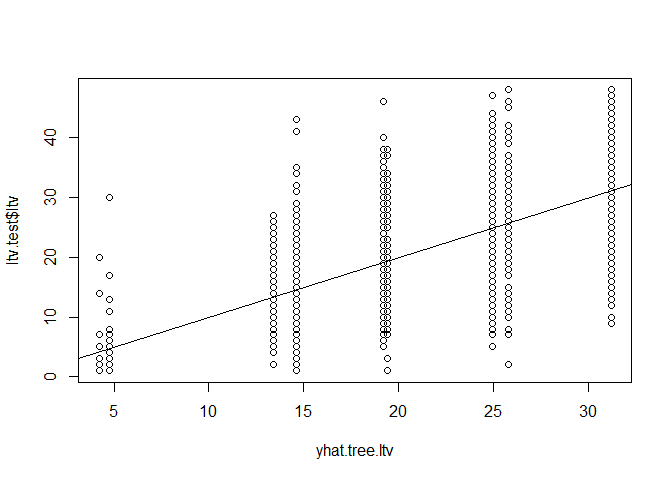

Predicting Customer Lifetime Value (Abridged)
================

  - [Introduction](#introduction)
  - [Context and Purpose](#context-and-purpose)
  - [Base Data](#base-data)
  - [Customer-Level Data](#customer-level-data)
  - [Exploratory: Customer Life-Time Value
    (LTV)](#exploratory-customer-life-time-value-ltv)
  - [Methodology: LTV Estimation](#methodology-ltv-estimation)
  - [Findings: LTV Estimation](#findings-ltv-estimation)
  - [References](#references)

``` r
library(lubridate)
library(ggplot2)
library(tidyverse)
library(GGally)
library(ggcorrplot)
library(leaps)
library(glmnet)
library(tree)

cbPalette <- c("#999999", "#E69F00", "#56B4E9", "#009E73", "#F0E442", "#0072B2", "#D55E00", "#CC79A7")

options(scipen = 4)
```

### Introduction

This code sample is an abridged version of a larger project submitted
for a data mining course in spring 2021. This project was submitted with
my teammates, *Callie Lambert* and *Tobi Jegede*. To best represent my
personal contributions, this version includes just the research question
and corresponding analyses that were primarily my responsibility. In
particular, the “Exploratory”, “Methodology”, and “Findings” sections
included here are most reflective of my individual contribution. The
larger project included two other research questions and corresponding
analyses, which were primarily the responsibilities of my teammates and
thus are excluded here. In any case, all parts of this project reflect
the teamwork, input, and revision of the entire team.

For the sake of brevity in this sample, I have excluded many exploratory
steps.

In this markdown file, in-text numbers and calculations are created
using inline code chunks, which are not displayed in this output.

### Context and Purpose

The goal of this abridged analysis is to advise an online greeting card
company by developing a model to estimate the lifetime value (LTV) of
their customers. In this context, the LTV of a customer is the $1
monthly subscription fee multiplied by the number of months they
subscribe.

### Base Data

The base data set contains four years of daily usage information for
10,000 customers, for the period from 1/1/2011 through 12/31/2014. The
fields are as follows:

  - `id`: A unique user identifier.
  - `status`: Subscription status where 0 = new, 1 = open, and 2 =
    cancellation event.
  - `gender`: User gender where M = male and F = female.
  - `date`: Date user logged into the site.
  - `pages`: Number of pages visited by user ‘id’ on date ‘date’. This
    variable is discrete because users can only visit whole numbers of
    pages.
  - `onsite`: Number of minutes user ‘id’ spent on the website on date
    ‘date’. This variable is continuous.
  - `entered`: Flag indicating whether or not user entered the send
    order path on date ‘date’.
  - `completed`: Flag indicating whether or not the user completed the
    order (sent an eCard) on date ‘date’.
  - `holiday`: Flag indicating whether or not at least one completed
    order included a holiday-themed card on date ‘date’.

<!-- end list -->

``` r
# summarize the data
summary(ltv)
```

    ##        id            status          gender               date           
    ##  Min.   :    1   Min.   :0.0000   Length:403835      Min.   :2011-01-01  
    ##  1st Qu.: 2537   1st Qu.:1.0000   Class :character   1st Qu.:2012-06-29  
    ##  Median : 5025   Median :1.0000   Mode  :character   Median :2013-05-04  
    ##  Mean   : 5017   Mean   :0.9909                      Mean   :2013-04-10  
    ##  3rd Qu.: 7495   3rd Qu.:1.0000                      3rd Qu.:2014-01-26  
    ##  Max.   :10000   Max.   :2.0000                      Max.   :2014-12-31  
    ##      pages            onsite           entered         completed     
    ##  Min.   : 0.000   Min.   :  0.000   Min.   :0.0000   Min.   :0.0000  
    ##  1st Qu.: 3.000   1st Qu.:  2.000   1st Qu.:1.0000   1st Qu.:0.0000  
    ##  Median : 5.000   Median :  5.000   Median :1.0000   Median :1.0000  
    ##  Mean   : 5.018   Mean   :  8.831   Mean   :0.7821   Mean   :0.5627  
    ##  3rd Qu.: 7.000   3rd Qu.: 11.000   3rd Qu.:1.0000   3rd Qu.:1.0000  
    ##  Max.   :10.000   Max.   :220.000   Max.   :1.0000   Max.   :1.0000  
    ##     holiday      
    ##  Min.   :0.0000  
    ##  1st Qu.:0.0000  
    ##  Median :0.0000  
    ##  Mean   :0.2277  
    ##  3rd Qu.:0.0000  
    ##  Max.   :1.0000

The daily usage data set has 403,835 rows and 9 columns. The data set is
clean and has no missing values, so no additional cleaning steps are
required.

There are 10,000 unique customers represented in the daily usage data.
All 10,000 of these customers begin their subscription with the company
within this four-year time period. Of these, 6,317 customers have ended
their subscription with the company by the end of this time period. This
leaves 3,683 customers whose subscription is still ongoing at the end of
2014. Of the total 10,000 unique customers, 7,924 are female and 2,076
are male.

The median number of pages visited by a user on a given date is 5 and
the mean is 5.02. The median minutes spent on the site by a user on a
given date is 5 and the mean is 8.83. In total, 78.21% of visits result
in a customer entering the send order path, 56.27% of visits result in a
customer completing an order, and 22.77% of visits result in a customer
completing an order with a holiday-themed card.

### Customer-Level Data

For this analysis, we need data at the customer level rather than daily
usage level.

``` r
# First, we started by creating new variables to aggregate information at the customer level
ltv.agg <- ltv %>%
  group_by(id) %>%
  mutate(
    
    # flag = 1 if customer has a cancellation event
    cancel = ifelse(status == 2,1,0),
    
    # avg number of pages visited by user per day visited
    avg.num.pages = mean(pages),
    # avg number of minutes spent by user per day visited
    avg.minutes = mean(onsite),
    
    # number of visits the user entered the send order path
    num.pending.orders = sum(entered),
    # number of visits the user completed an order
    num.completed = sum(completed),
    # number of visits the user ordered a holiday card
    num.holiday.cards = sum(holiday),
    # number of visits the user entered the order path but did not complete an order
    num.notcompleted = num.pending.orders - num.completed,
    
    # total number of visits
    num.visits = n(),
    
    # number of months of subscription
    length.sub = (lubridate::as_datetime(max(date)) -
                    lubridate::as_datetime(min(date))) %>% 
                  as.duration() %>%
                  as.numeric("months"),
    
    # months of subscription, rounded up
    length.sub.ceiling = ifelse(lubridate::as_datetime(max(date)) - 
                                  lubridate::as_datetime(min(date)) == 0, 
                                1, ceiling(length.sub)),
    
    # proportion of user's visits in which they entered the send order path
    prop.pending.orders = num.pending.orders / num.visits,
    # proportion of user's visits in which they completed an order
    prop.completed = num.completed / num.visits,
    # proportion of user's visits in which they ordered a holiday card
    prop.holiday.cards = num.holiday.cards / num.visits,
    # proportion of user's visits in which they entered the order path but did not complete an order
    prop.notcompleted = num.notcompleted / num.visits,

    # average number of visits per month of subscription         
    avg.visits.month = num.visits / length.sub.ceiling,

    # customer life-time value ($1 times number of month subscribed, rounded up)    
    ltv = 1 * length.sub.ceiling

    )

# With the new columns, we now filter to only have 1 row per customer
ltv.unique <-
  ltv.agg %>%
  select(id, gender, cancel, avg.num.pages, avg.minutes, num.pending.orders, num.completed, 
         num.holiday.cards, num.notcompleted, num.visits, length.sub, length.sub.ceiling,
         prop.pending.orders, prop.completed, prop.holiday.cards, prop.notcompleted, 
         avg.visits.month, ltv) %>%
  filter(row_number() == n())


# Create cancel subset for later use
ltv.unique.cancel <- ltv.unique[ltv.unique$cancel == 1,]
```

``` r
# Summary
summary(ltv.unique)
```

    ##        id           gender              cancel       avg.num.pages  
    ##  Min.   :    1   Length:10000       Min.   :0.0000   Min.   :2.571  
    ##  1st Qu.: 2501   Class :character   1st Qu.:0.0000   1st Qu.:4.778  
    ##  Median : 5000   Mode  :character   Median :1.0000   Median :5.045  
    ##  Mean   : 5000                      Mean   :0.6317   Mean   :5.196  
    ##  3rd Qu.: 7500                      3rd Qu.:1.0000   3rd Qu.:5.429  
    ##  Max.   :10000                      Max.   :1.0000   Max.   :9.400  
    ##   avg.minutes     num.pending.orders num.completed   num.holiday.cards
    ##  Min.   : 1.000   Min.   :  1.00     Min.   : 1.00   Min.   : 0.000   
    ##  1st Qu.: 7.577   1st Qu.: 14.00     1st Qu.:11.00   1st Qu.: 3.000   
    ##  Median : 8.792   Median : 24.00     Median :18.00   Median : 7.000   
    ##  Mean   : 9.363   Mean   : 31.58     Mean   :22.73   Mean   : 9.195   
    ##  3rd Qu.:10.412   3rd Qu.: 43.00     3rd Qu.:31.00   3rd Qu.:13.000   
    ##  Max.   :44.667   Max.   :134.00     Max.   :92.00   Max.   :37.000   
    ##  num.notcompleted   num.visits       length.sub     length.sub.ceiling
    ##  Min.   : 0.000   Min.   :  1.00   Min.   : 0.000   Min.   : 1.00     
    ##  1st Qu.: 3.000   1st Qu.: 18.00   1st Qu.: 9.922   1st Qu.:10.00     
    ##  Median : 6.000   Median : 31.00   Median :17.511   Median :18.00     
    ##  Mean   : 8.857   Mean   : 40.38   Mean   :18.727   Mean   :19.23     
    ##  3rd Qu.:13.000   3rd Qu.: 56.00   3rd Qu.:26.448   3rd Qu.:27.00     
    ##  Max.   :51.000   Max.   :166.00   Max.   :47.901   Max.   :48.00     
    ##  prop.pending.orders prop.completed   prop.holiday.cards prop.notcompleted
    ##  Min.   :0.2500      Min.   :0.1538   Min.   :0.0000     Min.   :0.0000   
    ##  1st Qu.:0.7368      1st Qu.:0.5152   1st Qu.:0.1739     1st Qu.:0.1509   
    ##  Median :0.7863      Median :0.5714   Median :0.2198     Median :0.2069   
    ##  Mean   :0.7857      Mean   :0.5875   Mean   :0.2101     Mean   :0.1983   
    ##  3rd Qu.:0.8333      3rd Qu.:0.6389   3rd Qu.:0.2535     3rd Qu.:0.2500   
    ##  Max.   :1.0000      Max.   :1.0000   Max.   :0.5455     Max.   :0.8333   
    ##  avg.visits.month       ltv       
    ##  Min.   : 0.3571   Min.   : 1.00  
    ##  1st Qu.: 1.5556   1st Qu.:10.00  
    ##  Median : 2.1786   Median :18.00  
    ##  Mean   : 2.4222   Mean   :19.23  
    ##  3rd Qu.: 2.7384   3rd Qu.:27.00  
    ##  Max.   :17.0000   Max.   :48.00

The created data set represents the 10,000 customers. This data set has
18 variables. Fields `id` and `gender` are kept unchanged from the
original data set. The other variables are created as follows:

  - `cancel`: Flag indicating whether or not the customer has a
    cancellation event within this time period.
  - `avg.num.pages`: Average number of pages visited by customer per day
    visited.
  - `avg.minutes`: Average number of minutes spent by customer per day
    visited.
  - `num.pending.orders`: Number of visits the customer entered the send
    order path.
  - `num.completed`: Number of visits the customer completed an order.
  - `num.holiday.cards`: Number of visits the customer ordered a holiday
    card.
  - `num.notcompleted`: Number of visits the customer entered the order
    path but did not complete an order.
  - `num.visits`: Total number of visits.
  - `length.sub`: Total number of months of subscription.
  - `length.sub.ceiling`: Total months of subscription, rounded up to
    full months (a user must pay for a full month, even if they cancel
    early).
  - `prop.pending.orders`: Proportion of customer’s visits in which they
    entered the send order path.
  - `prop.completed`: Proportion of customer’s visits in which they
    completed an order.
  - `prop.holiday.cards`: Proportion of customer’s visits in which they
    ordered a holiday card.
  - `prop.notcompleted`: Proportion of customer’s visits in which they
    entered the order path but did not complete an order.
  - `avg.visits.month`: Average number of visits per month.
  - `ltv`: Customer life-time value ($1 X `length.sub.ceiling`).

### Exploratory: Customer Life-Time Value (LTV)

As noted previously, LTV is calculated as the $1 monthly subscription
price times the number of months (rounded up) that a customer is
subscribed. A customer must pay for an entire month, even if they cancel
early.

The below histogram shows the distribution of customer LTV. This plot
includes only customers for which we have a conclusive LTV, i.e. those
customers who have started and ended their subscription within the time
frame of this data set. The distribution is slightly skewed right. The
minimum LTV is $1, the maximum is $48, the median is $19, and the mean
is $20.37.

``` r
# Histogram of LTV for customers who cancel
ggplot(data = ltv.unique.cancel, aes(x = ltv)) +
  geom_histogram() +
  ggtitle("Distribution of LTV Across Customers Who Start and End \nSubscription in this Time Period") +
  ylab("Count") + xlab("LTV ($)")
```

<!-- -->

We can also compare the LTV distribution across genders. The below
boxplots indicate that LTV values for females are generally larger than
for males. A t-test reveals that the average LTV for females ($21.12) is
statistically significantly larger than the average LTV for males
($18.03).

``` r
# Boxplot of LTV, customers who cancel, by gender
ggplot(data = ltv.unique.cancel, aes(x = ltv, fill = gender)) + 
  geom_boxplot() +
  ggtitle("Distribution of LTV For Customers Who Start and End \nSubscription in this Time Period, by Gender") +
  ylab("Count") + xlab("LTV ($)") +
  scale_fill_discrete(name = "Gender", labels = c("Female", "Male"))
```

<!-- -->

``` r
t.test(ltv ~ gender, data = ltv.unique.cancel)
```

    ## 
    ##  Welch Two Sample t-test
    ## 
    ## data:  ltv by gender
    ## t = 9.9089, df = 2581.7, p-value < 2.2e-16
    ## alternative hypothesis: true difference in means is not equal to 0
    ## 95 percent confidence interval:
    ##  2.481256 3.705570
    ## sample estimates:
    ## mean in group F mean in group M 
    ##        21.11880        18.02539

### Methodology: LTV Estimation

#### Introduction

Our objective is to develop a model for estimating the LTV of a
customer. To do this, we will explore various data mining prediction
modeling techniques and evaluate the performance of each to determine
the most useful model for this task.

For this analysis, we will use the customer-level data set restricted to
only customers for which we have a completed LTV value. In other words,
only customers who have started and ended their subscriptions in this
four-year period. Training a model on data that includes customers who
have not yet cancelled could result in an under-estimation of LTV,
because we do not have a true end point for these customers.

We will exclude some variables from the customer-level data set. First,
we will exclude `id`, because it is simply an identifier, and `cancel`,
because we have already restricted to just those customers who have
ended their subscriptions in this time period (`cancel` = 1). Further,
we will exclude the variables that represent total counts, in favor of
the variables that measure proportions instead. The excluded variables
are: `num.visits`, `num.notcompleted`, `num.holiday.cards`,
`num.completed`, and `num.pending.orders`. These are excluded because
both they and `ltv` are strongly related to the length of a customer’s
subscription, and thus they are not helpful for prediction. Related to
this, we also exclude `length.sub` and `length.sub.ceiling`, which is
exactly equal to a customer’s LTV. The benefit of the use of proportions
and averages in this model, rather than raw counts, is that predictions
of LTV can be made after observing just a few months of a customer’s
usage behavior.

``` r
# Create LTV estimation data set
ltv.unique.cancel.ltv <- subset(ltv.unique.cancel, select = -c(id, cancel, num.visits, 
                                                               num.notcompleted, num.holiday.cards, 
                                                               num.completed, num.pending.orders, 
                                                               length.sub, length.sub.ceiling))
```

With this restricted data set, we first explore correlations between the
variables. We will want to exclude variables that are highly correlated
with other variables to avoid the issue of multicollinearity, which can
lead to model estimates that are skewed and difficult to interpret. The
correlation plot below shows that no two variables are very highly
correlated (correlation coefficient greater than 0.80 or less than
-0.80), so no variables are excluded.

``` r
# Drop gender, ltv
ltv.unique.cancel.ltv.corrsub <- subset(ltv.unique.cancel.ltv, select = -c(gender, ltv))

# Correlation matrix
corr <- cor(ltv.unique.cancel.ltv.corrsub)
corr
```

    ##                     avg.num.pages  avg.minutes prop.pending.orders
    ## avg.num.pages          1.00000000  0.527080636           0.4746459
    ## avg.minutes            0.52708064  1.000000000           0.2161261
    ## prop.pending.orders    0.47464586  0.216126145           1.0000000
    ## prop.completed         0.63151644  0.340902594           0.6101368
    ## prop.holiday.cards     0.03191716 -0.007690818           0.1779732
    ## prop.notcompleted     -0.29528724 -0.199533339           0.2566373
    ## avg.visits.month       0.44742381  0.244590690           0.2851288
    ##                     prop.completed prop.holiday.cards prop.notcompleted
    ## avg.num.pages            0.6315164        0.031917163       -0.29528724
    ## avg.minutes              0.3409026       -0.007690818       -0.19953334
    ## prop.pending.orders      0.6101368        0.177973193        0.25663728
    ## prop.completed           1.0000000        0.151966740       -0.60917645
    ## prop.holiday.cards       0.1519667        1.000000000       -0.00724239
    ## prop.notcompleted       -0.6091764       -0.007242390        1.00000000
    ## avg.visits.month         0.3651458       -0.228437834       -0.16004016
    ##                     avg.visits.month
    ## avg.num.pages              0.4474238
    ## avg.minutes                0.2445907
    ## prop.pending.orders        0.2851288
    ## prop.completed             0.3651458
    ## prop.holiday.cards        -0.2284378
    ## prop.notcompleted         -0.1600402
    ## avg.visits.month           1.0000000

``` r
# Pairs plot
ggpairs(ltv.unique.cancel.ltv.corrsub, 
        title = "LTV Data Predictor Pairs Plot")
```

<!-- -->

``` r
# Correlation plot
ggcorrplot(corr, 
           lab = TRUE, 
           title = "LTV Data Predictor Correlation Plot")
```

<!-- -->

The next step before beginning model exploration is to randomly split
the data into training (80% of observations) and testing (20% of
observations) data. Models will be fit on the training data, and then we
can later evaluate their performance on the unseen testing data.

``` r
# Train/Test Split

set.seed(1)

test.indexes <- sample(1:nrow(ltv.unique.cancel.ltv), round(0.2 * nrow(ltv.unique.cancel.ltv)))
train.indexes <- setdiff(1:nrow(ltv.unique.cancel.ltv), test.indexes)

ltv.train <- ltv.unique.cancel.ltv[train.indexes,]
ltv.test <- ltv.unique.cancel.ltv[test.indexes,]
```

The training data set has 5,054 rows and the testing data set has 1,263
rows.

#### Subset Selection and Linear Regression Model

The first methodology we will explore is using best subset selection to
identify the best predictors for a linear regression model.

First, we use best subset selection to determine which variables in the
data can best predict a customer’s LTV. Best subset selection works by
fitting a linear regression model to every possible combination of
predictors in our data. We select the model with the lowest BIC
(Bayesian Information Criterion), which is a measure that captures the
trade-off between model error and model complexity.

Once we have determined the best set of predictors, we can use a
multiple linear regression model to predict LTV. A multiple linear
regression model allows us to measure the relationship between LTV and
the set of included predictors. This approach models these relationships
as linear and fits a regression line that minimizes the squared errors
between the predicted and actual LTV values. As we will explore later in
this section, we can interpret the coefficients in the resulting model
as the impact that each predictor has on LTV, holding all else constant.

``` r
# Best subset selection
ltv.bestsubset <- regsubsets(ltv ~ .,
                             data = ltv.train,
                             nbest = 1,
                             nvmax = NULL,
                             method = "exhaustive")
```

    ## Reordering variables and trying again:

``` r
# Plot
plot(ltv.bestsubset, scale = "bic", main = "Best Subset Selection")
```

<!-- -->

``` r
# Examine best predictors
coef(ltv.bestsubset, 5)
```

    ##         (Intercept)             genderM       avg.num.pages prop.pending.orders 
    ##          51.5081872          -7.9572185          -9.2114856           4.3138615 
    ##  prop.holiday.cards    avg.visits.month 
    ##          66.8001753          -0.2882612

The best subset selection process reveals that the best model includes
the following predictors: `gender`, `avg.num.pages`,
`prop.pending.orders`, `prop.holiday.cards`, and `avg.visits.month`.
Next, we fit a linear regression model with these identified predictors
on the training data. Using the model printout below, we can interpret
the coefficients on each term to explore these relationships.

``` r
# Fit model
fit.ltv.bs <- lm(ltv ~ gender + avg.num.pages + 
                   prop.pending.orders + prop.holiday.cards + 
                   avg.visits.month, data = ltv.train)
```

``` r
# Display output
coef(summary(fit.ltv.bs))
```

    ##                       Estimate Std. Error    t value      Pr(>|t|)
    ## (Intercept)         51.5081872  1.4937162  34.483248 3.529692e-234
    ## genderM             -7.9572185  0.3105271 -25.624873 2.974584e-136
    ## avg.num.pages       -9.2114856  0.2780048 -33.134267 5.141183e-218
    ## prop.pending.orders  4.3138615  1.7436785   2.474001  1.339359e-02
    ## prop.holiday.cards  66.8001753  1.8028615  37.052306 4.906003e-266
    ## avg.visits.month    -0.2882612  0.1175928  -2.451351  1.426579e-02

The interpretations are as follows:

  - All else in the model held constant, on average, being male is
    associated with having $7.96 lower LTV, compared to being female.

  - All else in the model held constant, on average, a customer’s
    average pages per visit increasing by 1 is associated with having
    $9.21 lower LTV.

  - All else in the model held constant, on average, a 10 percentage
    point increase in the proportion of a customer’s visits in which
    they enter the send order path is associated with having $0.431
    higher LTV.

  - All else in the model held constant, on average, a 10 percentage
    point increase in the proportion of a customer’s visits in which
    they purchase a holiday card is associated with having $6.68 higher
    LTV.

  - All else in the model held constant, on average, a customer’s
    average visits per month increasing by 1 is associated with having
    $0.29 lower LTV.

This estimates are all statistically significant, which means we can be
confident that they have not occurred by chance.

``` r
# Predict
pred.bs <- predict(fit.ltv.bs, ltv.test)

# MSE
MSE.bs <- mean((ltv.test$ltv - pred.bs)^2)
MSE.bs
```

    ## [1] 67.27123

Finally, the fitted regression model is used to make predictions with
the testing data. For each customer in the testing data set, we get a
predicted LTV value. These predicted values can then be compared with
the observed values to determine how well the model predicts the LTV
values. We will use the mean squared error (MSE), where “error” is the
difference between the predicted and observed values.

The linear regression model results in a MSE of 67.27. This suggests
that on average, this model predicts LTV values that are on average $8.2
off of the observed values.

#### Lasso Model

The second methodology we will explore is the lasso model. In contrast
to the subset selection and linear regression method described above,
the lasso method fits a model to all of the available predictors and
then “shrinks” the coefficient estimates by minimizing the squared
errors subject to a penalty. The estimates on some predictors will
become zero, meaning that they are selected out of the model.

The penalty referred to above is tuned using a parameter lambda. This
parameter controls the overall complexity of the model, which also
determines how well it makes predictions. Below, we will find the value
of lambda that minimizes error by using cross-validation, which is a
process the involves repeatedly fitting the model and calculating
prediction error at various values of lambda and with various cuts of
the data set. Then, we will also find the value of lambda that results
in cross-validation error that is within one standard error of the
minimum cross-validation error. This method (referred to as 1-SE-rule)
allows us to select a less complex model, which could have better
performance on the unseen testing data.

To use this method, we first fit a lasso model to the training data.
Next, we determine the value of lambda that minimizes CV error and the
1-SE-rule choice of lambda. The plot below shows the increasing
relationship between CV error and (log of) lambda.

``` r
# lasso
x.ltv <- model.matrix(ltv ~ ., ltv.train)[,-1]
y.ltv <- ltv.train$ltv

# cv
set.seed(1)
cv.ltv <- cv.glmnet(x.ltv, y.ltv, alpha = 1)
```

``` r
# Plot
plot(cv.ltv)
```

<!-- -->

``` r
# Lambda that minimizes CV error
lam.min <- cv.ltv$lambda.min
lam.min
```

    ## [1] 0.02484341

``` r
# 1-SE rule choice of lambda
lam.1se <- cv.ltv$lambda.1se
lam.1se
```

    ## [1] 0.4443616

``` r
grid = 10^seq(10, -2, length = 100)

lasso <- glmnet(x.ltv, y.ltv, alpha = 1, lambda = grid)

# Lambda min
lasso.min <- predict(lasso, type = "coefficients", s = lam.min)[1:9,]
lasso.min
```

    ##         (Intercept)             genderM       avg.num.pages         avg.minutes 
    ##         43.44920674         -7.64805702         -6.31112851         -0.08950773 
    ## prop.pending.orders      prop.completed  prop.holiday.cards   prop.notcompleted 
    ##          0.00000000        -13.87776215         70.73726992         19.18961629 
    ##    avg.visits.month 
    ##          0.00000000

``` r
# Lambda 1se
lasso.1se <- predict(lasso, type = "coefficients", s = lam.1se)[1:9,]
lasso.1se
```

    ##         (Intercept)             genderM       avg.num.pages         avg.minutes 
    ##        38.505571116        -5.917950132        -5.666150101        -0.007454516 
    ## prop.pending.orders      prop.completed  prop.holiday.cards   prop.notcompleted 
    ##         0.000000000        -9.877828751        63.361873015        18.678626345 
    ##    avg.visits.month 
    ##         0.000000000

The value of lambda that minimizes CV error is 0.0248. The value of
lambda that meets the one standard error rule is 0.4444. Next, we use
these tuning parameters in the lasso models to predict LTV in the
testing data.

``` r
# Matrix
xf.ltv <- model.matrix(ltv ~ ., ltv.test)[,-1]

# Predict
pred.minlasso <- predict(lasso, s = lam.min, newx = xf.ltv)

# MSE
MSE.minlasso <- mean((ltv.test$ltv - pred.minlasso)^2)
MSE.minlasso
```

    ## [1] 63.37353

``` r
# Predict
pred.1selasso <- predict(lasso, s = lam.1se, newx = xf.ltv)

# MSE
MSE.1selasso <- mean((ltv.test$ltv - pred.1selasso)^2)
MSE.1selasso
```

    ## [1] 65.10581

We can again use MSE to evaluate the performance of these models. The
lasso model with lambda that minimizes CV error has MSE of 63.37, and
the lasso model with lambda that meets the one standard error rule has
MSE of 65.11. These MSE values are lower than the MSE value from the
best subset linear regression model, indicating that these models
perform better at predicting customer LTV. However, these predictions
are still incorrect by $7.96 (using the lambda that minimizes CV error)
and $8.07 (using 1-SE-rule lambda) on average.

#### Regression Tree

The final model we will explore for predicting customer LTV is a
regression decision tree. Regression decision trees work by splitting
the data using various predictor values, and then averaging the LTV
value for the set of data points that end up at the end of each set of
branches. Each split is chosen to minimize the squared error between
actual and predicted LTV values.

First, we fit a tree model to the training data, and then we can prune
it. The pruning process involves cutting back on the tree branches in
order to improve prediction performance on the unseen testing data.
However, in this case, the un-pruned tree is the best option.

``` r
set.seed(1)

# Fit tree
tree.ltv <- tree(ltv ~ ., ltv.train)

tree.ltv
```

    ## node), split, n, deviance, yval
    ##       * denotes terminal node
    ## 
    ##  1) root 5054 576000 20.390  
    ##    2) prop.holiday.cards < 0.182373 1477  83180 12.770  
    ##      4) avg.visits.month < 2.97222 1199  54810 14.620 *
    ##      5) avg.visits.month > 2.97222 278   6461  4.770 *
    ##    3) prop.holiday.cards > 0.182373 3577 371500 23.540  
    ##      6) avg.num.pages < 5.18904 2639 244000 26.070  
    ##       12) prop.notcompleted < 0.154304 389  28750 19.410 *
    ##       13) prop.notcompleted > 0.154304 2250 195000 27.220  
    ##         26) avg.visits.month < 2.01111 1093  78370 24.920 *
    ##         27) avg.visits.month > 2.01111 1157 105400 29.390  
    ##           54) prop.holiday.cards < 0.217607 382  34190 25.770 *
    ##           55) prop.holiday.cards > 0.217607 775  63730 31.170 *
    ##      7) avg.num.pages > 5.18904 938  63430 16.440  
    ##       14) avg.visits.month < 3.21111 861  49640 17.540  
    ##         28) prop.completed < 0.662879 614  35870 19.210 *
    ##         29) prop.completed > 0.662879 247   7772 13.380 *
    ##       15) avg.visits.month > 3.21111 77   1259  4.221 *

``` r
summary(tree.ltv)
```

    ## 
    ## Regression tree:
    ## tree(formula = ltv ~ ., data = ltv.train)
    ## Variables actually used in tree construction:
    ## [1] "prop.holiday.cards" "avg.visits.month"   "avg.num.pages"     
    ## [4] "prop.notcompleted"  "prop.completed"    
    ## Number of terminal nodes:  9 
    ## Residual mean deviance:  61.69 = 311200 / 5045 
    ## Distribution of residuals:
    ##     Min.  1st Qu.   Median     Mean  3rd Qu.     Max. 
    ## -27.1700  -5.3770  -0.9213   0.0000   5.0790  30.3800

``` r
# Plot tree
plot(tree.ltv)
text(tree.ltv, pretty=0)
```

<!-- -->

``` r
# Prune tree
cv.ltv <- cv.tree(tree.ltv)

plot(cv.ltv$size, cv.ltv$dev, type='b')
```

<!-- -->

``` r
prune.ltv <- prune.tree(tree.ltv, best = 9)
```

The plot below shows the resulting decision tree. The first split in the
data uses the `prop.holiday.cards` variable. Data points with a value of
`prop.holiday.cards` \< 0.182373 are then split off into the left
branch. Then, another split is made on `avg.visits.month` that divides
that branch into two nodes. Data points with `prop.holiday.cards` \<
0.182373 and `avg.visits.month` \< 2.97222 have an average LTV of
$14.62. Data points with `prop.holiday.cards` \< 0.182373 and
`avg.visits.month` \>= 2.97222 have an average LTV of $4.77. The other
branches and nodes in the below tree can be interpreted similarly.

``` r
# Plot
plot(prune.ltv)
text(prune.ltv, pretty=0)
```

<!-- -->

``` r
# Predict
yhat.tree.ltv <- predict(prune.ltv, newdata = ltv.test)

# Plot predictions
plot(yhat.tree.ltv, ltv.test$ltv)
abline(0, 1)
```

<!-- -->

``` r
# Calculate MSE
MSE.tree.ltv <- mean((yhat.tree.ltv - ltv.test$ltv)^2)
MSE.tree.ltv
```

    ## [1] 63.10945

As before, we can use MSE to evaluate the performance of this model on
the testing data. The MSE of this model is 63.11, which is lower than
all of the previously-explored models. This model is also more easily
interpreted than the previous models. We choose this model as our final
model for predicting LTV.

### Findings: LTV Estimation

#### Main Findings

As discussed in the methodology section above, the best-performing model
for estimating customer LTV is the decision tree model. The tree image
is again displayed below.

``` r
# Plot
plot(prune.ltv)
text(prune.ltv, pretty=0)
```

<!-- -->

The customers with the highest LTV ($31.17) are those who order holiday
cards on 21.76% of visits or more, visit fewer than 5.19 pages per
visit, visit an average of 2.01 times per month or more, and who fail to
complete an order on 15.43% of visits or more. In general, these are
customers who relatively frequently order holiday cards and and visit
relatively few pages, though who also leave their order incomplete
fairly frequently.

The customers with the lowest LTV ($4.22) are those who order holiday
cards on 18.24% of visits or more, who visit 5.19 pages per visit on
average or more, and who visit the site 3.21 times per month on average
or more. In general, these customers also frequently order holiday
cards, but also visit the site more frequently and view more pages than
the customers with the highest LTV.

The MSE of this model is 63.11, which means that it can estimate
customer LTV with average error of $7.94.

The plot below shows how well LTV is estimated for customers. Each point
reflects a customer in the LTV test data. The x-axis reflects the
predicted LTV value, and the y-axis reflects the observed LTV value. The
plot also includes a y=x line, which reflects “perfect” prediction.
Points located near this line reflect customers whose LTV value is
estimated relatively accurately, while points farther away from the line
are estimated less accurately.

``` r
# Predictions
yhat.ltv.tree <- predict(prune.ltv, newdata = ltv.test)
ltv.test.ltv <- ltv.test$ltv

# Plot observed and predicted
plot(yhat.ltv.tree, ltv.test.ltv, 
     main = "Decision Tree Prediction Performance", 
     xlab = "Predicted LTV Values", 
     ylab = "Observed LTV Values")
abline(0, 1)
```

<!-- -->

#### Implications and Limitations

Given that the average deviation of the estimate from the actual
predicted value is just under $8 (which reflects eight months of
subscription), this model may not help the card company estimate
customer LTV to a very specific degree. One limitation that may be
contributing to this weakness in the model is the limited data we have
available. The only demographic variable we have is gender, but it seems
likely that factors like income level, age, or even geographic location
could be highly related to the LTV of a customer. It is possible that a
decision tree or other model applied to a data set that includes these
other demographic factors could result in better LTV estimates.

Regardless of the accuracy of the estimations, one benefit of the
decision tree model is that it is highly interpretable. This model
allows the card company to see which predictors are most important, and
which values of those predictors are associated with higher LTV. The
company could then determine how to promote certain strategies that
would increase customer LTV. For example, the highest LTV values are
associated with customers who order holiday cards on a high proportion
of visits, and who visit fewer than 5 pages per visit. The company could
thus figure out how to better market their product to people interested
in holiday cards, and make the process more streamlined so that they do
not have to navigate many pages when visiting.

Further, the benefit of using proportions and averages related to order
and visit activities as predictors in this model is that predictions of
LTV can be made after observing just a few months of a customer’s usage
behavior. The company can thus estimate a new customer’s LTV after just
a few months, and take action to try to encourage a higher LTV through
promotions or other actions as needed.

All in all, this model serves as a helpful tool for estimating customer
LTV. It could potentially be improved with better customer demographic
data, but still it provides helpful and interpretable insights for the
company to not only estimate customer LTV, but also to determine how to
improve their business and customer retention efforts.

### References

  - Course Materials

  - Gareth James, Daniela Witten, Trevor Hastie, and Robert Tibshirani.
    *An Introduction to Statistical Learning with Applications in R*.
    Springer, 2013.

  - “Markdown Basics,” RStudio,
    <https://rmarkdown.rstudio.com/authoring_basics.html>.

  - “Tools for Summarizing and Visualizing Regression Models,”
    <https://cran.r-project.org/web/packages/jtools/vignettes/summ.html#plot_summs_and_plot_coefs>
